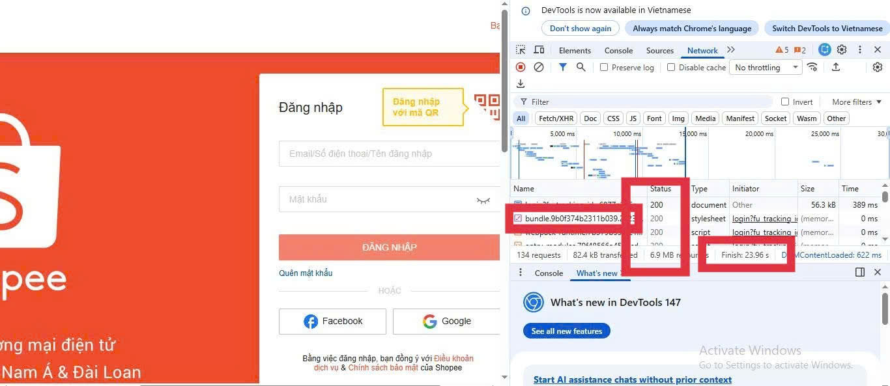

# PHẦN A
## CÂU A1(5đ) — HTTP & Browser
### Khi bạn gõ https://shopee.vn vào trình duyệt và nhấn Enter, hãy liệt kê đúng thứ tự ít nhất 5 bước xảy ra (từ DNS lookup đến render).
1 Gửi HTTP Request (GET): Trình duyệt (Client) gửi một yêu cầu GET / thông qua giao thức HTTP đến máy chủ (Server) của Shopee để xin file index.html.

2 Server phản hồi (200 OK): Máy chủ tìm file index.html và gửi ngược lại cho trình duyệt một mã phản hồi 200 OK kèm theo nội dung file HTML.

3 Parse HTML & Build DOM: Trình duyệt bắt đầu đọc file HTML từ trên xuống để xây dựng DOM Tree (cây cấu trúc trang). Trong quá trình này, nếu gặp các link CSS hoặc JS, trình duyệt sẽ tiếp tục gửi request để tải chúng về.

4 Parse CSS & Build CSSOM: Trình duyệt đọc các file CSS để xây dựng CSSOM Tree, áp dụng các quy tắc về màu sắc, font chữ và bố cục lên từng phần tử trong DOM.

5 Layout & Paint (Render): Sau khi có đủ cấu trúc và định dạng (và thực thi xong JS nếu có), trình duyệt tính toán vị trí các phần tử (Layout) và vẽ các pixel lên màn hình (Paint) để hiển thị giao diện Shopee cho người dùng.

#### Nguồn tham chiếu: File 01_introduction_html_universe.md - Mục 2 (Big Picture) và Mục 3 (Core Technical Truth).

### Trong DevTools của Chrome, tab Network cho thấy thông tin gì? Hãy mở một trang web bất kỳ, chụp screenshot tab Network và đánh dấu (vẽ mũi tên/khoanh tròn) vào:
#### 1. Tab Network trong DevTools cho thấy thông tin gì?
​Dựa vào phần 2. Big Picture và 3. Core Technical Truth trong tài liệu, tab Network là công cụ dùng để giám sát quá trình giao tiếp giữa Client (Browser) và Server. Cụ thể, nó hiển thị:
​Danh sách các file/tài nguyên mà trình duyệt tải về (HTML, CSS, JS, hình ảnh...).
​HTTP Methods (GET, POST...) được sử dụng cho từng yêu cầu.
​Status Code (Trạng thái phản hồi từ server như 200, 404, 500...).
​Thời gian tải (Timing) của từng file và tổng thời gian tải toàn bộ trang web.
​Kích thước (Size) của các tài nguyên được truyền tải qua internet.
#### 2 ​Hướng dẫn xác định các thành phần trên giao diện
​Cách tìm các thông tin theo yêu cầu:

Dưới đây là ảnh chụp màn hình tab Network:




**Các thông số đã đánh dấu:**
- **Status Code:** 200 (ở dòng đầu tiên).
- **Tổng thời gian load trang:** Finish 23.96 s.
- **Request file CSS:** Dòng bundle... có type là stylesheet.

#### Nguồn tham chiếu
​Tên file: 01_introduction_html_universe.md
​Phần trong tài liệu: * Mục 2. Big Picture — Web hoạt động như thế nào?: Giải thích về luồng Request - Response giữa Browser và Server.
​Mục 3. Core Technical Truth — HTTP: Giải thích về các loại Method và Status Codes (200, 404...).
​Mục 6. Hands-on Practice: Hướng dẫn cách mở DevTools (F12) để quan sát thực tế.

## CÂU A2  (5đ) — Semantic HTML
Đọc chương 04, trả lời: Tại sao trang web dưới đây bị Google đánh giá SEO thấp? Liệt kê ít nhất 4 lỗi semantic và sửa lại. 
### Tại sao trang web dưới đây bị Google đánh giá SEO thấp và đây là lý do:

- Các thẻ `<header>`, `<nav>`, `<main>`, `<footer>`: Giúp Google phân loại ngay lập tức các thành phần của trang.

- Thẻ `<h2>: Khẳng định "iPhone 16 Pro" là một nội dung quan trọng trong trang.

- Thẻ `<article>`: Cho biết đây là một nội dung độc lập (một thực thể sản phẩm), rất có lợi khi Google hiển thị kết quả tìm kiếm dưới dạng "Rich Snippets".

- Thẻ ul và li: Giúp cấu trúc danh sách menu rõ ràng hơn thay vì chỉ là các thẻ div rời rạc.
### 4 lỗi và sửa lại là
- Lỗi 1	`<div class="header">`	Không xác định được phần đầu của trang web.	Thay bằng thẻ `<header>`.
- Lỗi 2	`<div class="menu">`	Trình duyệt không biết đây là khu vực điều hướng chính.	Thay bằng thẻ `<nav>`.
- Lỗi 3	`<div class="title">`	Tiêu đề sản phẩm không được phân cấp, Google không biết đây là từ khóa quan trọng.	Thay bằng thẻ `<h1>` (nếu là tiêu đề trang) hoặc `<h2>`.
- Lỗi 4	`<div class="footer">`	Không xác định được thông tin bản quyền/liên hệ ở cuối trang.Thay bằng thẻ `<footer>`.

## Câu A3 (5đ) — Block vs Inline
### Không chạy code, hãy vẽ tay (hoặc mô tả bằng text art) kết quả hiển thị của đoạn HTML sau. Giải thích tại sao.

#### Mô tả text art
Hộp 1
<br>
Text AText B
<br>
Hộp 2
<br>
Text C**Text D**
<br>
Hộp 3

#### Về giải thích
- Nhóm 1: Thẻ Block-level (`<div>`)
Đặc điểm: Luôn bắt đầu trên một dòng mới và chiếm trọn vẹn chiều ngang của trang web (giống như một viên gạch xây tường).

Áp dụng: 
Hộp 1: Chiếm riêng hàng 1.
Hộp 2: Đẩy nội dung trước đó xuống và chiếm riêng hàng 3.
Hộp 3: Đẩy nội dung trước đó xuống và chiếm riêng hàng 5.

- Nhóm 2: Thẻ Inline (`<span>`, `<strong>`)
Đặc điểm: Chỉ chiếm vừa đủ không gian của nội dung bên trong nó và không tự tạo dòng mới. Các thẻ này sẽ "xếp hàng ngang" sát nhau nếu còn chỗ.

Áp dụng:

Text A và Text B: Vì đều là inline, chúng sẽ nằm sát nhau trên cùng hàng 2 (ngay dưới Hộp 1).

Text C và Text D: Tương tự, chúng nằm sát nhau trên cùng hàng 4 (ngay dưới Hộp 2). Thẻ `<strong>` làm cho chữ "Text D" trông đậm hơn.

## Câu A4 (5đ) — Table
### Đọc chương 05. Giải thích sự khác nhau giữa `<thead>`, `<tbody>`, `<tfoot>`. Tại sao KHÔNG NÊN dùng table để tạo layout trang web? (Ghi rõ ít nhất 3 lý do)

#### 1. Sự khác nhau giữa `<thead>`, `<tbody>` và `<tfoot>`

Việc phân chia bảng thành 3 phần giúp trình duyệt và các thiết bị hỗ trợ hiểu rõ cấu trúc dữ liệu:

* **`<thead>` (Table Header):** * Dùng để chứa hàng tiêu đề của bảng (thường là các thẻ `<th>`).
    * Giúp xác định tên gọi của từng cột dữ liệu.
* **`<tbody>` (Table Body):** * Là phần thân của bảng, chứa toàn bộ dữ liệu chính cần hiển thị.
    * Đây là nơi tập trung nhiều hàng (`<tr>`) và ô dữ liệu (`<td>`) nhất.
* **`<tfoot>` (Table Footer):** * Dùng để chứa các hàng tổng kết, ghi chú cuối bảng (ví dụ: Tổng tiền, Tổng cộng).
    * Giúp người dùng dễ dàng nắm bắt kết quả sau khi đọc hết dữ liệu ở phần body.

> **Lợi ích kỹ thuật:** Giúp cải thiện khả năng truy cập (Accessibility) cho người khiếm thị và giúp CSS dễ dàng định dạng riêng biệt từng phần của bảng.

---

#### 2. Tại sao KHÔNG NÊN dùng table để tạo layout trang web?

Dưới đây là 3 lý do quan trọng khiến việc dùng `<table>` để dàn trang là một sai lầm:

1.  **Sai mục đích ngữ nghĩa (Semantics):** Thẻ `<table>` được tạo ra chỉ để hiển thị dữ liệu dạng bảng (hàng và cột có ý nghĩa). Việc dùng nó cho bố cục (layout) sẽ làm các công cụ tìm kiếm (SEO) và trình đọc màn hình bị rối, không hiểu được nội dung chính của trang.
2.  **Tốc độ tải trang chậm (Performance):** Trình duyệt thường phải đợi tải xong toàn bộ code của bảng mới bắt đầu tính toán kích thước và hiển thị. Nếu layout trang nằm trong một table lớn, người dùng sẽ phải chờ đợi lâu hơn để thấy nội dung hiện ra.
3.  **Khó làm Web thích ứng (Responsive):** Bảng có cấu trúc rất cứng nhắc. Việc biến một layout table từ 3 cột trên máy tính thành 1 cột trên điện thoại là cực kỳ khó khăn so với việc sử dụng các công cụ hiện đại như **CSS Flexbox** hoặc **Grid**.


# Phần B Câu 3 danh sách lỗi trong file debug.html

- Lỗi 1: Dòng 1 — Khai báo <!DOCTYPE> thiếu "html" — Sửa thành: !DOCTYPE html
- Lỗi 2: Dòng 2 — Thẻ `<title> thiếu thẻ đóng `</title>` — Sửa thành: `<title>` Trang web `</title>`
- Lỗi 3: Dòng 3 — Giá trị charset "utf8" chưa chuẩn hóa — Sửa thành: meta charset="UTF-8"
- Lỗi 4: Dòng 4 — Thẻ đóng của `<h1>` viết sai cú pháp (thiếu dấu gạch chéo) — Sửa thành: `</h1>`
- Lỗi 5: Dòng 8 — Thẻ đóng của thẻ `<a>` viết sai cú pháp — Sửa thành: `</a>`
- Lỗi 6: Dòng 15 — Thuộc tính src của thẻ `` thiếu dấu ngoặc kép — Sửa thành: src="iphone.jpg"
- Lỗi 7: Dòng 15 — Thẻ `` thiếu thuộc tính "alt" (lỗi ngữ nghĩa/accessibility) — Sửa thành: thêm alt="iPhone 16 Pro"
- Lỗi 8: Dòng 17 — Sai thứ tự đóng thẻ (Nesting error) — Sửa thành: `<p>``<b>` 25.990.000đ `</b>``</p>`
- Lỗi 9: Dòng 33 — Sử dụng thẻ `<main>` lần thứ hai (Mỗi trang chỉ có duy nhất một thẻ main) — Sửa thành: Đổi thẻ `<main>` này thành `<aside>`
- Lỗi 10: Dòng 37 — Thẻ `<p>` trong `<footer>` thiếu thẻ đóng `</p>` — Sửa thành: Thêm `</p>` sau nội dung
- Lỗi 11: Dòng 38 — Thiếu thẻ đóng `</html> ở cuối trang — Sửa thành: Thêm `</html> vào dòng cuối cùng
- Lỗi 12: Dòng 14 & 23 — Thứ tự tiêu đề không hợp lý (Nhảy từ `<h1>` sang `<h3>`) — Sửa thành: Đổi các thẻ `<h3>` thành `<h2>` để đảm bảo tính phân cấp (Hierarchy).

# PHẦN C— SUY LUẬN (20 điểm)
## Câu C1 (10đ) — Thiết kế cấu trúc
```html 
<header> 
<!-- ​<header>: Phần đầu của trang web, chứa bộ nhận diện thương hiệu và menu chính. -->
    <nav aria-label="primary"> 
    <!-- <nav> (primary): Khu vực điều hướng chính của website. -->
        <ul> 
            <li>
                <a href="">Trang chủ</a>
            </li> 
        </ul>
    </nav>
</header>

<nav aria-label="breadcrumb"> 
<!-- ​<nav> (breadcrumb): Điều hướng phân cấp giúp người dùng biết vị trí trang hiện tại. -->
    <ol> 
    <!-- <ol>: Danh sách có thứ tự vì Breadcrumb cần thể hiện đúng cấp bậc từ ngoài vào trong. -->
        <li><a href="">Trang chủ</a></li> 
        <li><a href="">Điện thoại</a></li> 
        <li>iPhone 16</li> 
    </ol>
</nav>

<main> 
<!-- <main>: Chứa nội dung quan trọng nhất, cốt lõi và duy nhất của trang này. -->
    <article> 
   <!-- ​<article>: Bao quanh một thực thể nội dung có thể đứng độc lập (như một sản phẩm cụ thể). -->
        <section class="gallery"> 
        <!-- ​<section> (gallery): Một phân đoạn riêng chứa bộ sưu tập hình ảnh sản phẩm. -->
            <figure> 
            <!-- ​<figure>: Dùng để đóng gói hình ảnh minh họa có ý nghĩa cho nội dung bài viết. -->
                 
            </figure>
            
            <div class="thumbnails"> 
                 
                 
                 
                 
            </div>
        </section>

        <section class="info"> 
        <!-- <section> (info): Phân đoạn chứa thông tin cơ bản, mô tả và giá cả sản phẩm. -->
            <h1>Tên sản phẩm</h1> 
            
            <p class="price">Giá</p> 
            
            <div class="rating">Đánh giá sao</div> 
            
            <p class="desc">Mô tả sản phẩm</p> 
        </section>

        <section class="specs"> 
        <!-- <section> (specs): Phân đoạn riêng biệt dùng để liệt kê thông số kỹ thuật. -->
            <h2>Thông số kỹ thuật</h2> 
            
            <table> 
            <!-- <table>: Dùng để trình bày dữ liệu đối chiếu dạng hàng và cột cho chuyên nghiệp. -->
                <thead> 
                    <tr> 
                        <th>Thuộc tính</th> 
                        <th>Chi tiết</th> 
                    </tr>
                </thead>
                <tbody> 
                    <tr> 
                        <td>Màn hình</td> 
                        <td>6.1 inch</td> 
                    </tr>
                </tbody>
            </table>
        </section>

    </article>

    <aside> 
    <!-- <aside>: Chứa nội dung phụ, liên quan gián tiếp như sản phẩm tương tự hoặc quảng cáo. -->
        <h2>Sản phẩm tương tự</h2> 
        <ul> 
            <li>
                <a href="#">Sản phẩm A</a>
            </li> 
        </ul>
    </aside>

    <section class="reviews"> 
    <!-- <section> (reviews): Phân đoạn dành riêng cho phản hồi và đánh giá của khách hàng. -->
        <h2>Đánh giá/Bình luận</h2> 
    </section>

</main>

<footer> 
<!-- <footer>: Phần chân trang, chứa các thông tin pháp lý hoặc bản quyền. -->
    <p>Bản quyền 2026</p> 
</footer>
```
### Câu C2 (10đ) — So sánh & Tranh luận
#### Một đồng nghiệp nói: "Dùng <div> cho mọi thứ rồi thêm class là được, không cần semantic HTML. Tốn thời gian học thêm thẻ mới."Viết 1 đoạn phản biện (200-300 từ), phải bao gồm:

Phản biện: Tại sao không nên "div-hóa" mọi thứ?
Quan điểm "chỉ dùng `<div>` cho nhanh" thực tế là một món nợ kỹ thuật mà chúng ta sẽ phải trả giá đắt trong tương lai. Có hai lý do kỹ thuật cốt lõi khiến Semantic HTML không chỉ là sở thích, mà là tiêu chuẩn bắt buộc

**Ít nhất 2 lý do kỹ thuật (SEO, Accessibility)**

- Về SEO (Tối ưu hóa công cụ tìm kiếm): Các công cụ tìm kiếm như Google không "nhìn" trang web như con người. Chúng sử dụng các con bot để quét mã nguồn. Nếu mọi thứ đều là `<div>`, con bot sẽ rất vất vả để xác định đâu là nội dung chính, đâu là phần phụ. Sử dụng `<main>`, `<article>` hay `<h1>` giống như việc bạn gắn biển chỉ dẫn rõ ràng trên xa lộ, giúp nội dung được ưu tiên xếp hạng cao hơn.

- Về Accessibility (Khả năng tiếp cận): Những người khiếm thị sử dụng trình đọc màn hình (Screen Readers) dựa hoàn toàn vào các thẻ ngữ nghĩa để điều hướng. Nếu bạn dùng `<div>`, trình đọc sẽ chỉ thấy một khối văn bản vô hồn. Với thẻ `<nav>`, người dùng có thể nhảy nhanh đến menu; với thẻ `<footer>`, họ biết đâu là thông tin bản quyền mà không cần phải đọc từ đầu đến cuối trang.

**1 ví dụ cụ thể chứng minh semantic HTML giúp ích**

Một ví dụ cụ thể: Hãy tưởng tượng bạn đang xây dựng một bảng thông số kỹ thuật cho iPhone. Nếu dùng `<div>`, bạn phải viết thêm rất nhiều CSS và JavaScript để định nghĩa cấu trúc. Nhưng nếu dùng thẻ `<table>`, trình duyệt mặc định hiểu đây là dữ liệu đối sánh. Khi người dùng nhấn phím tắt để nhảy giữa các ô, trình đọc màn hình sẽ tự động đọc tiêu đề cột tương ứng, điều mà một đống `<div>` lồng nhau không bao giờ làm được nếu không có thêm hàng tá thuộc tính ARIA phức tạp.

**1 trường hợp thực tế mà `<div>` vẫn phù hợp**

Tuy nhiên, `<div>` không hề xấu. Thẻ này vẫn cực kỳ phù hợp trong các trường hợp thuần túy về trình bày. Ví dụ: khi bạn cần một cái khung bao bên ngoài để tạo hiệu ứng đổ bóng, bo góc bằng CSS, hoặc tạo các khối bọc (wrapper) để căn chỉnh layout (như Flexbox/Grid) mà không mang ý nghĩa nội dung. Lúc đó, `<div>` là lựa chọn trung lập và đúng đắn nhất vì nó không gây nhiễu cho cấu trúc ngữ nghĩa của trang.

Tóm lại, học thêm thẻ mới không tốn thời gian bằng việc phải đi sửa lỗi SEO hay fix lỗi hiển thị cho người khuyết tật sau này!